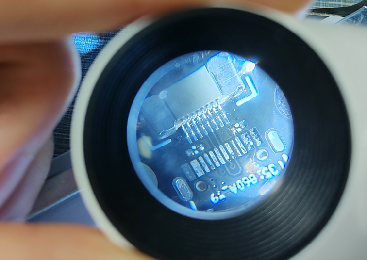

# Readme

pengxuexi's learning records——Timeline

---

涉及技能：

1. 原理图设计
2. PCB布局布线
3. BOM表的整理
4. 元器件采购
5. 元器件焊接
6. 板卡测试
7. stm32软件编程
8. PCB设计软件：allegro designer、kicad和cadence allegro都有学习，allegro designer使用的最多，我的理解是kicad开源轻便，cadence allegro适合大型工程的分组分工

涉及知识：

1. 信号完整性和电源完整性

## 1、元器件焊接练习

包括0805电容电阻，0603电容电阻、0402电阻，二极管，QFP封装芯片、排阻

## 2、stm32评估板

主控用的是stm32f103c8t6，想制作设计一个简单的小系统评估板，参考网上的一些设计，比如电源电路，晶振，复位，SD卡，eeporm等，但这是一款有问题的设计

设计制作好PCB，导出Gerber文件，打板，BOM表整理，采购，焊接、测试

## 3、stm32评估板 2.0

吸取上一次的教训，重新设计评估板，加上之前测试好的ips模块，总体包括：晶振电路、复位电路、按键、LED、USB、IPS、电源稳压电路，后面发现USB电路还是有问题的，应该转电平

打板，BOM表整理，采购，焊接、测试

用cubemx生成stm32初始化代码，使用clion编辑led验证代码并编译烧录，验证无误

编写代码，点亮ips：

## 4、esp32验证板

不论是网上的已经验证的开发板焊接，还是自己设计的板卡程序烧录都有问题，主要收获就是QFN的焊接，探索了一下，积累了很多焊接经验

打板，BOM表整理，采购，焊接、测试

## 5、复刻稚晖君的ElectronBot

[peng-zhihui/ElectronBot (github.com)](https://github.com/peng-zhihui/ElectronBot)

是一个非常有意思的桌面级小机器工具人，但是复刻到后面舵机的控制一直不顺利，至今还未完成，主要涉及打板，焊接，烧录，测试，组装等

## 6、复刻ST-Link-Nano

是一个超迷你的ST-Link模块，相较于市面上的stlink，有typec的接口，并且非常mini，成本低，复刻很成功，焊接注意细节就好。验证烧录也没有问题

## 7、

