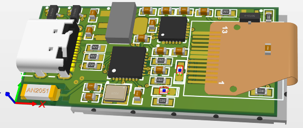
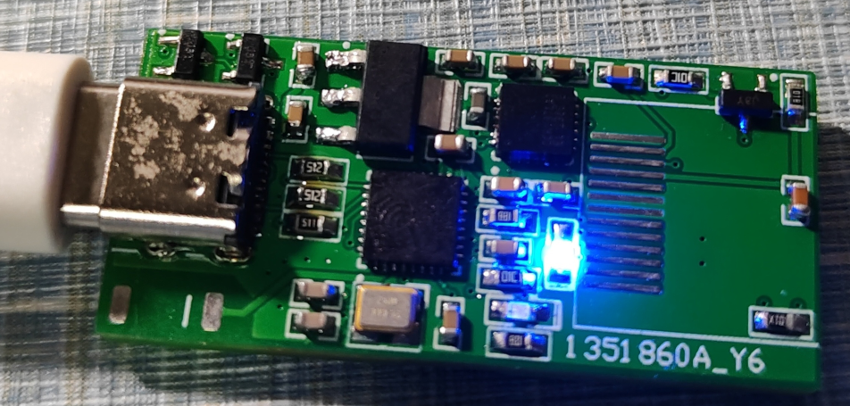
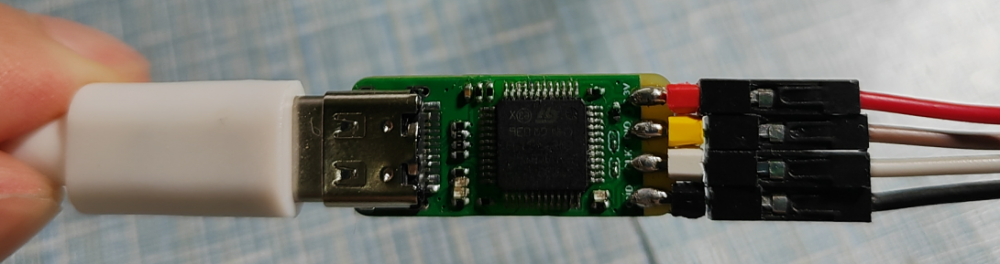

# Readme

pengxuexi's learning records——Timeline

---

- [Readme](#readme)
  - [1、元器件焊接练习](#1元器件焊接练习)
  - [2、stm32评估板](#2stm32评估板)
  - [3、stm32评估板 2.0](#3stm32评估板-20)
  - [4、esp32验证板](#4esp32验证板)
  - [5、复刻稚晖君的ElectronBot](#5复刻稚晖君的electronbot)
  - [6、复刻ST-Link-Nano](#6复刻st-link-nano)
  - [7、复刻Planck-Pi](#7复刻planck-pi)
  - [8、跨阻放大器外围电路设计](#8跨阻放大器外围电路设计)
  - [9、开发板学习记录](#9开发板学习记录)

---

1. 原理图设计
2. PCB布局布线
3. BOM表的整理
4. 元器件采购
5. 元器件焊接
6. 板卡测试
7. stm32软件编程
8. PCB设计软件：allegro designer、kicad和cadence allegro都有学习，allegro designer使用的最多，我的理解是kicad开源轻便，cadence allegro适合大型工程的分组分工

涉及知识：

1. 信号完整性和电源完整性

## 1、元器件焊接练习

包括0805电容电阻，0603电容电阻、0402电阻，二极管，QFP封装芯片、排阻

## 2、stm32评估板

主控用的是stm32f103c8t6，想制作设计一个简单的小系统评估板，参考网上的一些设计，比如电源电路，晶振，复位，SD卡，eeporm等，但这是一款有问题的设计

设计制作好PCB，导出Gerber文件，打板，BOM表整理，采购，焊接、测试

## 3、stm32评估板 2.0

吸取上一次的教训，重新设计评估板，加上之前测试好的ips模块，总体包括：晶振电路、复位电路、按键、LED、USB、IPS、电源稳压电路，后面发现USB电路还是有问题的，应该转电平

打板，BOM表整理，采购，焊接、测试

用cubemx生成stm32初始化代码，使用clion编辑led验证代码并编译烧录，验证无误

编写代码，点亮ips：

## 4、esp32验证板

不论是网上的已经验证的开发板焊接，还是自己设计的板卡程序烧录都有问题，主要收获就是QFN的焊接，探索了一下，积累了很多焊接经验

打板，BOM表整理，采购，焊接、测试

## 5、复刻稚晖君的ElectronBot

[peng-zhihui/ElectronBot (github.com)](https://github.com/peng-zhihui/ElectronBot)

是一个非常有意思的桌面级小机器工具人，但是复刻到后面舵机的控制一直不顺利，至今还未完成，主要涉及打板，焊接，烧录，测试，组装等

## 6、复刻ST-Link-Nano

是一个超迷你的ST-Link模块，相较于市面上的stlink，有typec的接口，并且非常mini，成本低，复刻很成功，焊接注意细节就好。验证烧录也没有问题

## 7、复刻Planck-Pi

[peng-zhihui/Planck-Pi: Super TINY & Low-cost Linux Develop-Kit Based On F1C200s. (github.com)](https://github.com/peng-zhihui/Planck-Pi)

本项目是一个基于全志F1C200s芯片的超迷你&低成本的Linux开发板，复刻进度止于登录进Linux开发板，软件层面未作探索

仅复刻硬件就踩了不少坑，密集管脚的QFN芯片焊接手法要更加细腻，烧录系统也需要选择好合适的软件和SD卡，耗时较长的项目复刻

登录系统没问题

## 8、跨阻放大器外围电路设计

该项目不方便开放，主要是一款跨阻的外围电路设计，涉及高频信号线的处理，对比官方的评估板卡，我设计的板卡在高频点总是有一个噪声的尖峰，板卡迭代数次均未消除，后面将板卡的材料换成高频PCB，即特氟龙材料才得到大大改善，但是带宽依旧不能达到芯片标称的750MHz，随后想找出问题，接触到信号完整性问题

去跟成都的一家硬件公司的工程师做过交流，问题应该还是出在阻抗上面，电源带来的噪声不会那么稳定

另外工程师提到，普通的FR4板材的PCB板卡是可以做到8GHz的，我知道多层板的内部，有良好的参考平面对于重要的信号线是非常友好的，但是换层也意味着阻抗的失配，高频板为什么能消除那个高频的噪声是因为高频材料的平面非常平整，阻抗连续性很好，FR4材料的表面就像衣服的纤维一样，非常粗糙，阻抗连续性比较差，所以信号的带宽越高，信号的失真就越严重，引起的各种信号反射叠加等也会越严重

## 9、开发板学习记录

学过的开发板比较多，有自己买的，也有比赛用的，记录一下

